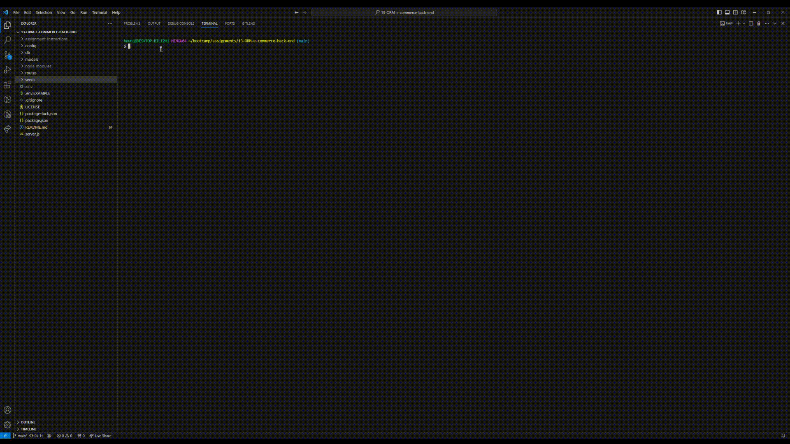
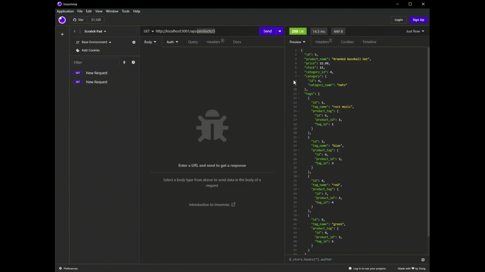
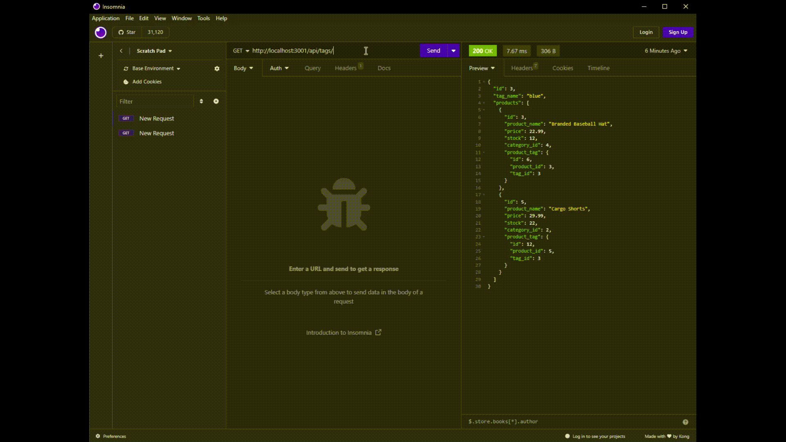

# 13-ORM-E-Commerce-Back-End
 

## Description
Back end for an e-commerce site. 

## Table of Contents
- [Installation](#installation)
- [Usage](#usage)
- [License](#license)
- [Contributing](#contributing)
- [Questions](#questions)


## Installation
1. Clone this [repository](https://github.com/hjlee17/13-ORM-e-commerce-back-end.git).

2. Install [MySQL](https://www.mysql.com/downloads/).
3. Install [Node.js] (https://nodejs.org/).
4. Install the dependencies using the ```npm i``` command. The following packages will be installed:
   - [Inquirer v.8.2.4](https://www.npmjs.com/package/inquirer/v/8.2.4)
   - [MySQL2 v.2.2.5](https://www.npmjs.com/package/mysql2/v/2.2.5)
   - [dotenv v.8.2.0](https://www.npmjs.com/package/dotenv/v/8.2.0)

5. In [.env.EXAMPLE](.env.EXAMPLE), fill in the user and password, and save as an .env file (remove .EXAMPLE extension).


## Usage
1. Create the schema, seed the database, and start the application's server.  
Click link for [video demo](https://drive.google.com/file/d/1GCzVHfIIurNg7EeRDtKlOAQVCOfbb05J/view?usp=sharing).  
  

2. GET routes for all categories, all products, and all tags being tested in Insomnia.
Click link for [video demo](https://drive.google.com/file/d/1CZCkpjp5XqSN9Al24v1If8Wmz7SGn46v/view?usp=sharing).  
 

3. GET routes for a single category, a single product, and a single tag being tested in Insomnia.  
Click link for [video demo](https://drive.google.com/file/d/1Kgpi7E9e5x_Z8ywoOqHQSsbO4cVEFTsD/view?usp=sharing).  
 

4. POST, PUT, and DELETE routes for categories being tested in Insomnia.  
Click link for [video demo](https://drive.google.com/file/d/1kpPDR5D72MORzcvx29l9RhLEeDHDQImv/view?usp=sharing).  
 

5. POST, PUT, and DELETE routes for products being tested in Insomnia.  
Click link for [video demo](https://drive.google.com/file/d/1ajnx0RlDW7yS6Lbo0zrKj2swhv523FCX/view?usp=sharing).  
 

6. POST, PUT, and DELETE routes for tags being tested in Insomnia.  
Click link for [video demo](https://drive.google.com/file/d/1w1aaJKno6fEB2uDMothIFvzzLZyctBhD/view?usp=sharing).  
 


## License
[The MIT License](https://opensource.org/licenses/MIT/)

## Contributing
- [Sequelize](https://sequelize.org/docs/v6/) documentation
- BootCampSpot


## Questions
- Github: [hjlee17](https://github.com/hjlee17)
